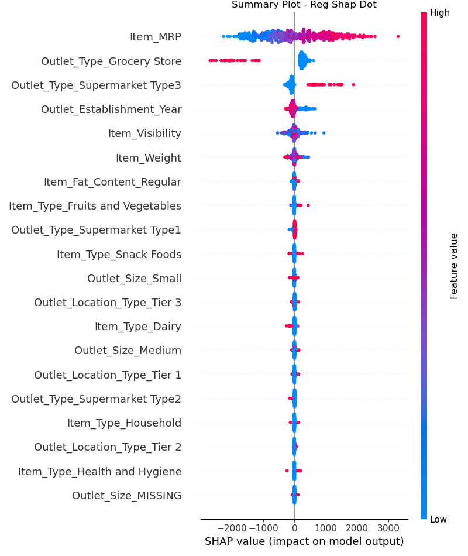

# Food Sales Predictions
## Analyzing Sales Trends and Making Predictions

**Daniel Barella**: 

### Often times in buisness, you are given too much information, or it's scattered and seems unrelated. With the powers of data science, we are able to peer deeper, and see clearer:

### Data Source:
sales_predictions.csv
https://drive.google.com/file/d/1syH81TVrbBsdymLT_jl2JIf6IjPXtSQw/view

## To prepare this data, the data was cleaned, and the following processes were performed:

### Exploratory Data Analysis
    - During the exploratory data analysis, a boxplot and histogram was visualized.
    - Also, a heatmap was produced.
    - This helped visualize what was correlated.
    
 ### Expanatory Data Analysis
    - To visualize the data for explantory purposes, a scatterplot, and a bargraph were created.
    - The bargraph was chosen to show how the Outlet Type is related to the sales.

#### Item Outlet Sales vs. Item MRP

It seems that as the Item MRP goes up the Item Outlet Sales do as well.  With the Outlet Type as the legend, you can see that Supermarket Type 3 leads the pack with Item Outlet sales.

#### Item Outlet Sales vs. Outlet Type

Having the Outlet Types and the Outlet Location Type seperate but on the same 
graph, we get a real picture of what type of stores and what type of location produces the most sales.

## Maching Learning Using the Following Models:
    - Linear Regression Model
    - Decision Tree Regressor Model
    
## Results

## Linear Regression Model

Training Data:	R^2= 0.56	RMSE= 1139.10
Test Data:	R^2= 0.57	RMSE= 1092.86
 
### Coefficients 

- Outlet_Type_Supermarket Type3 - The presence of supermarkets of type 3 has the biggest positive impact on sales of products.

- Outlet_Size_Large - The larger the outlet, the higher the sales of products. This may be because larger outlets typically offer more product options for customers.

- Outlet_Type_Grocery Store - Grocery store outlet types have a negative impact on sales compared to other types of outlets. This could be due to a limited selection of products or other factors such as location or marketing strategies that are less effective for grocery stores.

## Regression Tree Model

Training Data:	R^2= 0.94	RMSE= 428.11
Test Data:	R^2= 0.55	RMSE= 1120.33 
 
### Importances

- Item_MRP: This is the most important feature, which means the price of the item has the strongest impact on sales. A higher price may result in higher sales if the product is perceived as high-quality.

- Outlet_Type_Grocery Store: This feature has a positive impact on sales, which means that having a grocery store outlet type is correlated with higher sales. This could be due to various factors like location or product selection that are more effective for grocery stores.

- Item_Visibility: The visibility of the item on the shelves is another important factor affecting sales. Higher visibility may result in more purchases as customers are more likely to notice the product.

- Outlet_Type_Supermarket Type3: This feature has a positive impact on sales, indicating that supermarket type 3 has a higher impact on sales compared to other types of outlets. Supermarket type 3 may have a larger selection of products or other factors that lead to more sales.

- Item_Weight: The weight of the item also affects sales, but to a lesser extent than the other features. This could be due to various factors like customer preferences or perceived value based on weight.

### Summary Plot - Bar Version

- Both show Item_MRP as being the most important feature.
- Outlet_Type_Grocery Store is also coming in as a strong second for both graphs.
- Our original graph shows Item_Visibility in third place, but the shap graph shows us Outlet_Type_Supermarket Type3 in third.

### Summary Plot - Dot Version

- The higher the Item_MRP, the higher the Shap value
- If it is a Outlet_Type_Grocery Store, then it's will have a lower shap value.
- If it is a Outlet_Type_Supermarket Type3 then it is going to positively affect the shap value.

### Local Explanations

- I chose to go with the highest and lowest sales, to be able to see the contrast as to what features help the model make the decisions.

- The low_sales_force_plot shows that there are no positive features, and at least two features that are affecting this store negatively.  

- The low_sales_lime_explanation, shows no positive features; and the Outlet_Type_Grocery Store, Item_MRP, Outlet_Type_Supermarket Type3, are greatly affecting this store negatively.	

- The high_sales_force_plot is showing that Outlet_Type_Grocery, Item_MRP, are greatly pushing this store into the positive.

- The high_sales_lime_explanation is showing once again that Outlet_Type_Grocery, Item_MRP, are the main features that can swing the sales numbers of a specific store.

## Recommendations:

Run a Random Forest model, this would feed the model more data, which I think would increase accuracy.

## Limitations & Next Steps

Not enough correlation between data and target. I would recommend running a Random Forest Model.

### For further information

For any additional questions, 
please contact 
**Daniel Barella**
**hansolothe3rd@hotmail.com**
